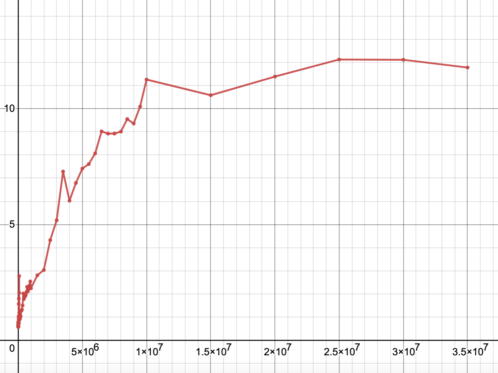
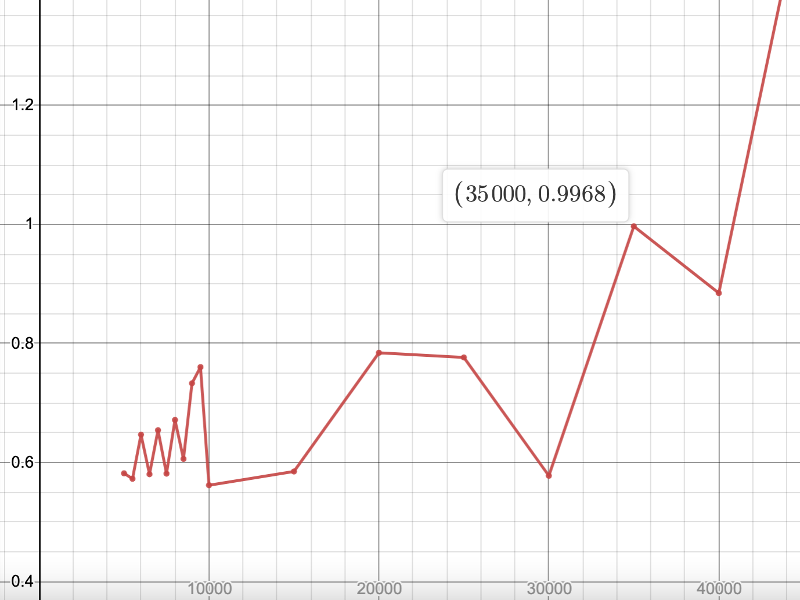
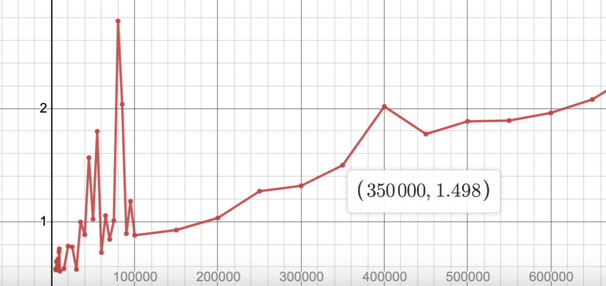
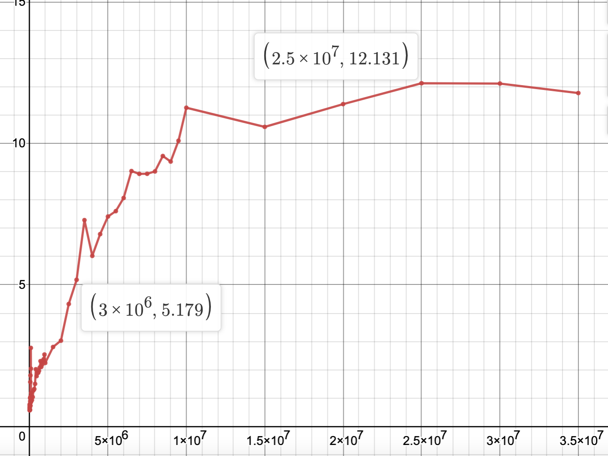

# Benchmarking Assignment

## Program Overview

To run this program run `make` followed by `./benchmarking`.

This program creates estimates the time need to access a byte
from memory out of various sizes of buffers. The measurements
are run in the `run_tests` which takes as input `buff_begin`,
the buffer size to begin tests at, `buff_end`, the approximate
buffer size to end tests at, and `tests` the run of tests to
run for each buffer size.

The tests are run from the range `buff_begin` to approximately `buff_end`. At each iteration of the testing loop the buffer size increase by half of the current order of magnitude (from 5000 to 5500 or 100000 to 150000).
During each iteration of the testing loop a random list of memory address is generated. This is done to beat the prefetcher.
Then from `tests` number of times a byte is accessed from memory. The total time taken to access all of these bytes is recorded and then the average time is computed. This average is printed and then stored in the file `output.txt`.

## Graph

## Analysis

Based on the data I have collected I would estimate my L1, L2, and L3 caches to be approximately 35000, 315000, and 2650000 bytes, respectively.
These estimates are based on the largest jumps in my graph (see close up graphs).
The actual size of these caches are 32768, 262144, and 3145728 bytes, respectively.
I am fairly close for all of these sizes. The slight differences could come from my sparse data. If I had taken more measurements I may have seen better results.

# Barriers

## Program Overview

I was unable to complete this part of the assignment. I will try to work on it more over break but because I have never parallel programmed before I was struggling to understand how to do so. Instead of blindly copying stack overflow I've decided to take more time on this assignment so I can really learn these techniques.

## Analysis

I suspect that centralized barriers will not scale well since there are O(P) messages on the critical path. However if space is a concern then a centralized barrier would be preferred since it requires only O(1) space.

I suspect that dissemtinations barriers would scale better than centralized barriers since there are only O(logP) messages on the critical path

I suspect that MCS barriers would scale the best. MCS barriers have O(PlogP) messages on the critical path and take O(P) space. They also have the minimum amount of communication with only 2P-2 messages sent.
